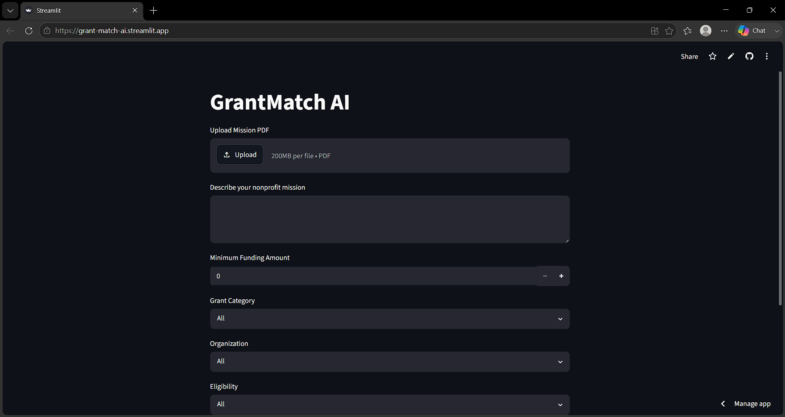
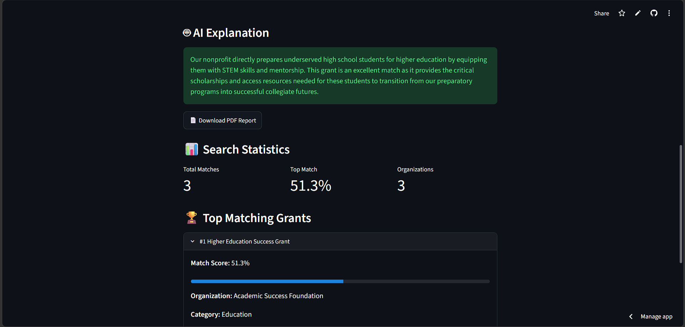
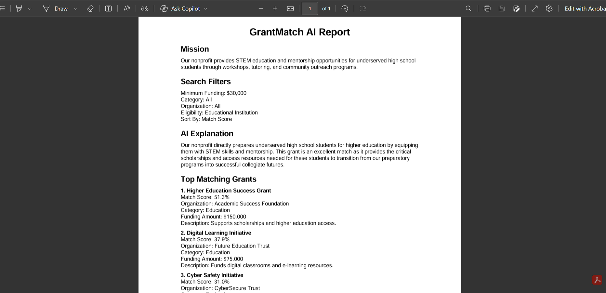

# 🎯 GrantMatch AI

GrantMatch AI is an AI-powered grant discovery platform that helps nonprofits identify funding opportunities that best align with their mission.

The application leverages semantic search, sentence embeddings, and generative AI to retrieve relevant grant opportunities, rank them by semantic similarity, and generate human-readable explanations for funding recommendations.

---

## 🚀 Live Demo

🔗 https://grant-match-ai.streamlit.app

---

## ✨ Features

### 🔍 Semantic Grant Matching

Uses Sentence Transformers embeddings and cosine similarity to compare nonprofit mission statements against grant descriptions.

### 🤖 AI-Powered Explanations

Uses Google Gemini to generate explanations describing why a grant is a strong match for a nonprofit's mission.

### 📄 PDF Mission Upload

Upload an existing mission statement PDF and automatically extract text for analysis.

### 🎛️ Advanced Filtering

Filter grants by:

* Category
* Organization
* Eligibility
* Minimum funding amount

### 📊 Intelligent Ranking

Sort results by:

* Match Score
* Funding Amount (High to Low)
* Funding Amount (Low to High)
* Organization (A-Z)

### 📥 PDF Report Generation

Generate downloadable PDF reports containing:

* Mission statement
* Search filters
* AI explanation
* Top matching grants

### ⚡ Fast Search Experience

Uses precomputed embeddings and cached models to provide efficient grant matching.

## 📊 Retrieval Evaluation

Grant Match AI includes a custom retrieval evaluation framework for benchmarking semantic search performance using standard Information Retrieval (IR) metrics.

### Evaluation Framework

- 100 human-curated benchmark queries
- Human-annotated ground truth
- Standard retrieval metrics:
  - Hit Rate
  - Precision@5
  - Recall@5
  - Mean Reciprocal Rank (MRR)
  - Average Retrieval Latency
- Automatic generation of:
  - JSON reports
  - CSV reports
  - Markdown reports
  - Performance charts

### Evaluation Results

| Metric                     |    Result |
| -------------------------- | --------: |
| Benchmark Queries          |   **100** |
| Hit Rate                   |   **98%** |
| Precision@5                | **28.8%** |
| Recall@5                   |   **97%** |
| Mean Reciprocal Rank (MRR) | **0.894** |
| Average Retrieval Latency  | **54 ms** |

The evaluation framework provides a repeatable benchmark for measuring retrieval quality and tracking future improvements to the semantic search pipeline.

---

## 🛠️ Tech Stack

### Frontend

* Streamlit

### Backend

* Python

### Database

* SQLite

### Machine Learning

* Sentence Transformers
* all-MiniLM-L6-v2
* Scikit-learn

### Artificial Intelligence

* Google Gemini 2.5 Flash

### Document Processing

* PyPDF
* ReportLab

### Evaluation

* Custom Benchmarking
* Matplotlib

---

## 🏗️ System Architecture

```text
                    ┌────────────────────────┐
                    │   User Input           │
                    │ (PDF / Mission Text)   │
                    └──────────┬─────────────┘
                               │
                               ▼
                    ┌────────────────────────┐
                    │ PDF Text Extraction    │
                    │      (PyPDF)           │
                    └──────────┬─────────────┘
                               │
                               ▼
                    ┌────────────────────────┐
                    │ Mission Validation     │
                    │ (Meaningful Input)     │
                    └──────────┬─────────────┘
                               │
                               ▼
                    ┌────────────────────────┐
                    │ Mission Embedding      │
                    │ (SentenceTransformer)  │
                    └──────────┬─────────────┘
                               │
                               ▼
                    ┌────────────────────────┐
                    │ Grant Filtering        │
                    │ (Funding, Category,    │
                    │ Organization, etc.)    │
                    └──────────┬─────────────┘
                               │
                               ▼
                    ┌────────────────────────┐
                    │ Grant Embeddings       │
                    │ (Precomputed)          │
                    └──────────┬─────────────┘
                               │
                               ▼
                    ┌────────────────────────┐
                    │ Cosine Similarity      │
                    │ Matching & Ranking     │
                    └──────────┬─────────────┘
                               │
                               ▼
                    ┌────────────────────────┐
                    │ Gemini AI Explanation  │
                    └──────────┬─────────────┘
                               │
                               ▼
                    ┌────────────────────────┐
                    │ Results Dashboard      │
                    │ + PDF Report           │
                    └────────────────────────┘
```

---

## 🚀 Installation

### Clone the Repository

```bash
git clone https://github.com/Akhil-kadapa/Grant-Match-AI.git
cd GrantMatch-AI
```

### Install Dependencies

```bash
pip install -r requirements.txt
```

### Create Environment Variables

Create a `.env` file in the project root:

```env
GOOGLE_API_KEY=your_gemini_api_key
```

### Run the Application

```bash
streamlit run app.py
```

---

## 📁 Project Structure

```text
Grant-Match-AI/
│
├── app.py                      # Main Streamlit application
├── create_db.py                # Creates the SQLite grant database
├── generate_embeddings.py      # Generates sentence embeddings
├── grants.csv                  # Grant dataset
├── grants.db                   # SQLite database
│
├── evaluation/                 # Retrieval evaluation framework
│   ├── scripts/
│   ├── benchmark.py
│   ├── evaluator.py
│   ├── metrics.py
│   ├── reporter.py
│   ├── charts.py
│   └── results/
│
├── screenshots/                # Application screenshots
│   ├── home-page.png
│   ├── search-results.png
│   └── pdf-report.png
│
├── requirements.txt            # Python dependencies
├── README.md                   # Project documentation
└── .gitignore                  # Git ignore rules
```
---

## 📖 How It Works

1. Upload a nonprofit mission PDF or enter a mission statement.
2. Apply grant filters.
3. Click **Find Grants**.
4. Semantic similarity is calculated using embeddings.
5. Grants are ranked by relevance.
6. Gemini generates an AI explanation.
7. Results are displayed.
8. Download a professional PDF report.

---

## 📸 Screenshots

### 🏠 Home Page



---

### 📊 Search Results



---

### 📄 Generated PDF Report




## 🔮 Future Improvements

* Real-time grant ingestion pipeline
* Cloud database integration
* User authentication
* Saved searches and bookmarks
* Grant deadline tracking
* AI-powered grant proposal drafting
* Multi-grant AI comparison
* Analytics dashboard

---

## 🧪 Example Use Cases

* Nonprofit organizations seeking funding opportunities
* Educational institutions searching for grants
* Community organizations exploring funding sources
* NGOs matching missions with available grants
* Research groups identifying relevant funding programs

---

## 🔒 Security

* API keys are stored using environment variables.
* Sensitive credentials are excluded through `.gitignore`.
* No secrets are stored in source control.

---

## 📜 License

This project is intended for educational, learning, and portfolio purposes.

---

## 👨‍💻 Author

**Ahamed Akhil Kadapa**

M.S. Artificial Intelligence, University of Bridgeport

Machine Learning | Artificial Intelligence | AI Engineering


Built using Python, Streamlit, Sentence Transformers, SQLite, and Google Gemini.
